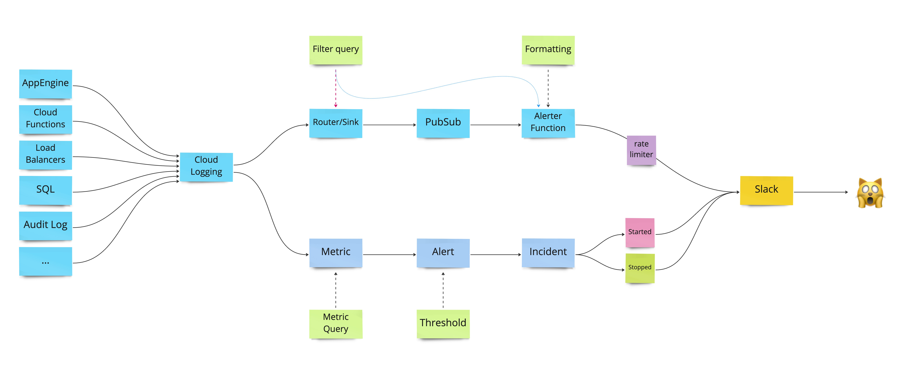

# Blaise Slack Alerter

This is a Cloud Function which is used to send alerts from Google Cloud Logging to Slack.

## How it Works

Some GCP infrastructure is required for this to working.

1. **A PubSub Topic**:<br>
    Log messages will be put on this topic and trigger the Cloud Function.
2. **Google Cloud Logging [Log Sink](https://cloud.google.com/logging/docs/routing/overview)**:<br>
    - This should be configured to route the log message to the PubSub topic.
    - It should have an appropriate _inclusion_ and _exclusion_ filter.
3. **PubSub IAM policy**:<br>
     Granting `roles/pubsub.publisher` for the Log Sink.
4. **Google Cloud Function**:<br>
    Running this code.

In addition to this, you will need an **[Incoming Slack WebHook](https://api.slack.com/messaging/webhooks) URL**.

### Diagram

```
CLOUD LOGGING -> LOG SINK -> PUBSUB TOPIC -> CLOUD FUNCTION -> SLACK WEBHOOK
```



### Granting Sink Access To The PubSub Topic

```shell
gcloud logging sinks describe --format='value(writerIdentity)' <SINK_NAME>
gcloud pubsub topics add-iam-policy-binding <TOPIC_ID> --member=<WRITER_IDENTITY> --role=roles/pubsub.publisher
```

### Cloud Function Config

**Entry Point**: `send_slack_alert`

| Environment Variable | Value                                                                                              |
|----------------------|----------------------------------------------------------------------------------------------------|
| `SLACK_URL`          | Slack Web Hook URL.                                                                                |
| `GCP_PROJECT_NAME`   | The exact name of the GCP project. This is used to generate links to the GCP dashboard.            |

## Development

This repository uses poetry. After cloning, install the dependencies by running:

```shell
poetry install
```

### Makefile

A `Makefile` is included with some useful tasks to help with development.
Running `make help` will list all available commands.

### GitHub Actions

The GitHub Actions run the linter, typechecker and tests.

To avoid getting failures, it's worth running `make test` before commit.
Note, `make test` also runs the typechecker and linter.

### Linting Errors

Linting errors can usually be fixed quickly with `make format`.
